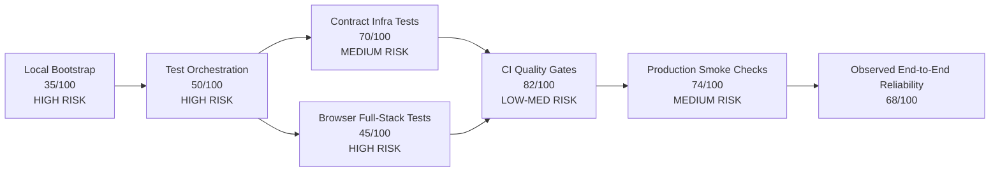

# End-to-End Infra Audit + Regograph

Date: 2026-03-01  
Scope: Local dev infra, test orchestration, CI gates, deployment smoke coverage, and full-stack execution path (`browser -> web/admin -> api -> postgres/redis/litellm`).

## Executive Summary

End-to-end infra is partially production-ready.

- Core monorepo quality gates pass (`type-check`, `lint`, `unit/integration`).
- Infra orchestration and full-stack test execution are brittle in local environments.
- CI validates API contract infra and smoke UI, but does not enforce browser full-stack infra tests.
- Current smoke checks verify service reachability, not full dependency-chain correctness.

Overall readiness estimate: **68/100**.

## Regograph (Readiness + Risk Graph)

## Evidence Collected

### Passed

1. `npm run check` passed (Turbo type-check + lint + tests across packages/apps).
2. Static infra checks passed:
   - `scripts/check-rate-limit.sh`
   - `scripts/check-destructive-sql.sh`
   - `scripts/check-api-contracts.sh` (45 routes documented)
   - `scripts/check-guardrail-usage.sh`

### Failed / Blocked

1. `npm run dev:check` failed in this environment:
   - PostgreSQL CLI missing
   - Redis CLI missing
2. `scripts/test-e2e-infra.sh --api` failed immediately:
   - Docker not running / unavailable.
3. `npm run test:contract` failed: **52/52 failed** with `ECONNREFUSED localhost:3002`.
4. `npm run test:e2e:fullstack` failed: **9/9 failed**.
   - `localhost:3001` connection refused (admin app absent).
   - `localhost:3000` returned a **404 page from another process**, causing false-target assertions.

## Prioritized Gaps

### P0 (must fix to trust E2E infra signal)

1. **Local contract tests are not self-orchestrated.**
   - `npm run test:contract` assumes API is already up on `:3002`; it does not start infra.
   - Impact: frequent false failures, low confidence in local infra testing.
   - Evidence:
     - `vitest.e2e.config.ts` runs tests directly, no service bootstrap.
     - `tests/e2e-infra/api-integration.test.ts` uses fetch to `E2E_API_URL` default `http://localhost:3002`.

2. **Browser full-stack tests can hit wrong targets silently.**
   - `playwright.e2e.config.ts` has no `webServer` orchestration and no precondition checks.
   - In this run, port `3000` responded but served unrelated `404` content.
   - Impact: misleading failures and possible false positives if unrelated app matches selectors.
   - Evidence:
     - `tests/e2e-infra/web-full-stack.spec.ts` failures with heading `404`.
     - `curl localhost:3000` returned HTTP 404 while intended app was not running.

3. **CI does not enforce browser full-stack infra tests.**
   - CI `e2e` job runs `playwright.config.ts` (smoke tests under `tests/e2e`) only.
   - Full-stack tests under `tests/e2e-infra/*.spec.ts` are not run in CI.
   - Impact: browser->api->db regressions can ship undetected.

### P1 (high-value hardening)

4. **`test-e2e-infra.sh` hard-requires Docker command availability.**
   - Exits before checking alternate execution modes.
   - Impact: blocked local verification on machines without Docker.
   - Note: script message says services may run outside Docker, but preflight exits earlier if Docker is missing.

5. **Production smoke tests are shallow.**
   - `smoke-prod.yml` checks health and HTML reachability, not critical business-path transactions.
   - Impact: deploy can pass smoke while key flows still broken (auth-protected routes, DB write paths, routing to API).

6. **Health endpoint does not verify full dependency chain.**
   - `/api/health` checks DB status only.
   - No Redis/LiteLLM status in health response.
   - Impact: “healthy API” can hide degraded infra dependencies.

### P2 (medium hardening)

7. **Preview deploy gate is effectively warning-only.**
   - `check-preview-deploy.sh` exits 0 even when UI PR lacks preview comment.
   - Impact: non-blocking visual regression risk.

8. **Potential compose health-check brittleness.**
   - `docker-compose.yml` uses `curl` in `litellm`/`strapi` health checks; availability depends on image contents.
   - Redis health check uses `redis-cli ping` without auth arg while `requirepass` may be set.

## Infra Chain Assessment

### Chain: Browser -> Web/Admin

- Status: **At risk locally**
- Reason: `playwright.e2e.config.ts` assumes running servers at fixed ports; no ownership/identity validation of service.

### Chain: Web/Admin -> API

- Status: **Partially covered**
- Covered by:
  - Full-stack specs in `tests/e2e-infra/*` (not CI-enforced)
  - API contract tests in CI when API is bootstrapped in workflow

### Chain: API -> Postgres/Redis/LiteLLM

- Status: **Partially covered**
- Covered by:
  - CI `api-contract` job sets Postgres+Redis and runs contract tests.
- Gaps:
  - No CI hard dependency test for LiteLLM behavior in contract job.
  - Health endpoint does not expose Redis/LiteLLM health state.

## Recommended Fix Plan

### Sprint 1 (P0)

1. Add orchestration wrapper for `npm run test:contract`:
   - Start API + required deps automatically (or fail with explicit actionable precondition report).
2. Add environment sanity checks before running full-stack Playwright:
   - Assert expected app identity on `:3000`/`:3001` before tests start.
3. Add CI job for `playwright.e2e.config.ts` against provisioned API + web + admin services.

### Sprint 2 (P1)

4. Expand production smoke tests with one synthetic read/write path:
   - e.g., create prompt version + fetch it.
5. Extend `/api/health` to include Redis and LiteLLM connectivity status.
6. Make preview-deploy check blocking for UI changes once integration is stable.

### Sprint 3 (P2)

7. Harden compose health checks for auth and tool availability.
8. Add one-command local full-stack bootstrap (`make`/script) with deterministic readiness waits.

## Confidence

High (0.91): conclusions are based on direct script/workflow inspection and executed command outcomes in this workspace.
